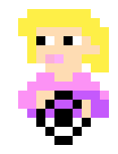
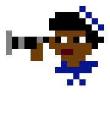
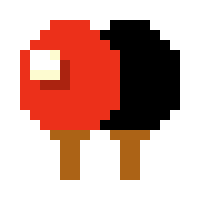
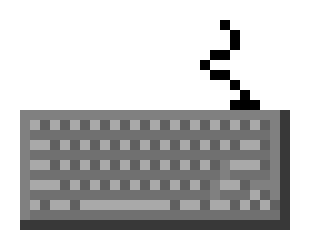

# Pair Programming 8-bit Assets

This repo contains free to use 8-bit art that describe pair programming techniques and roles.
The techniques were inspired by the Medium article 
[Pair Programming: Taking turns with your pair](https://medium.com/@marlenac/pair-programming-taking-turns-with-your-pair-32fc344d62b9)
by [Marlena Compton](https://twitter.com/marlenac?lang=en).

The art was created using the open-source tool [make8bitart](https://github.com/jennschiffer/make8bitart)
by [Jenn Schiffer](https://twitter.com/jennschiffer).

## Contact

If you like this art and would like to use them, please cite me and let me know [@TerminatingCode](https://twitter.com/TerminatingCode).
I'm also open to ideas for what other roles/techniques could use a handy 8-bit icon for a presentation!

## Assets

### Driver & Navigator

### Techniques

